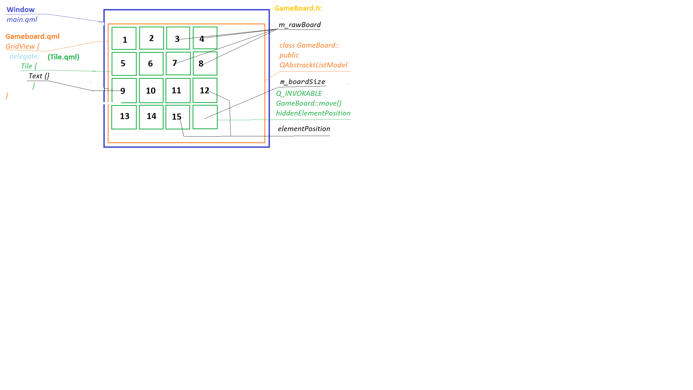

<h1 align = "center"> spielen Sie das Spiel und ordnen Sie alle Zahlen in der Reihenfolge an. </h1>

---

dieses Spiel ist eine Windows-Desktop-Anwendung
## starten der Anwendung
- Die Anwendung wird in jeder Qt/C ++ - IDE ausgeführt. Nach dem Erstellen und Kompilieren wird die Ausgabedatei 15_puzzle erhalten.exe
- OS Windows 10
- Qt 6.2
- CMake 3.16
- Compiler MSVC oder MINGW_64
## beschreibung des Codes
- **das Projekt verwendet die Model-View-Controller-Architektur**

   **Qml** - GridView

   das **Model** wurde in Qt/C++ erstellt(class GameBoard) und in qml als "GameBoardModel" registriert

  die dimension- und hiddenElementValue -Eigenschaften werden ebenfalls aus dem qml-Objekt GriedView aufgerufen

  die GameBoard::move() -Funktion wird beim Klicken auf den Delegaten aufgerufen und steuert die Bewegung der Puzzles
  
 

  

### GameBoard::move() 
-   **getRowCol(index)** berechnet die Position des gedrückten und letzten unsichtbaren Puzzles in 2D Raum (x, y)
-   **isAdjacent()** berechnet den Abstand zwischen Element Position und hidden Element Position. und wenn der Abstand = 1, ändert sich der Inhalt des Vektors anhand ihrer Indizes

#### class GameBoard
- wenn das GameBoard initialisiert wird, wird ein std::vector erstellt und mit den vom std::mt19937-Generator generierten Zahlen gefüllt

  
